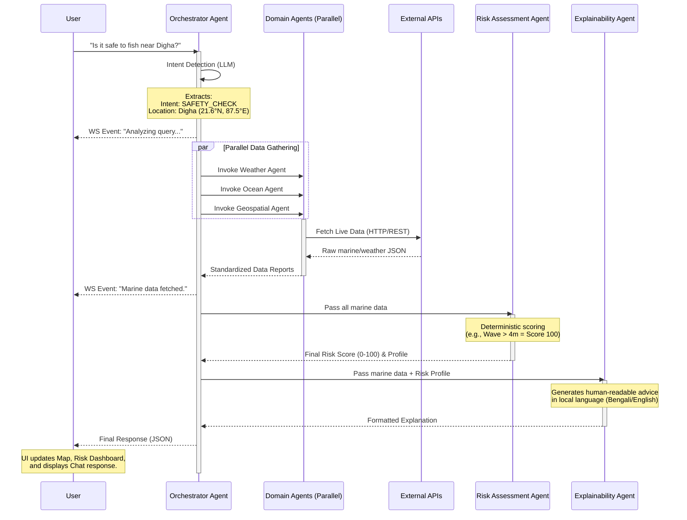

# 🐋 ORCA - Marine Decision Intelligence Platform

An **Agentic AI-powered** marine decision intelligence platform that coordinates specialized AI agents to analyze ocean, weather, satellite, and geospatial data — providing fishermen and marine stakeholders with explainable safety and operational recommendations.

Built for the **Smart India Hackathon (SIH)**.

## 🚀 Features

- **Agentic Orchestration:** A LangGraph-inspired state machine that delegates complex natural language queries to specialized agents.
- **Zero Mock Data:** 100% live integrations with Open-Meteo (Marine & Weather) and geographic math for EEZ/MPA calculation.
- **Deterministic Risk Engine:** Safety scoring is calculated using absolute mathematical thresholds (not LLM hallucinations).
- **Explainable AI:** Uses Google Gemini to translate raw JSON risk profiles into local-language advice (Bengali, Hindi, English).
- **Real-Time Visualization:** Interactive React-Leaflet map with dynamic routes, risk zones, and PFZ (Potential Fishing Zone) heatmaps.

---

## 🧠 System Architecture

ORCA is built on a decoupled, modular architecture that emphasizes specialized intelligence over a single monolithic LLM.

```mermaid
graph TD
    %% Styling
    classDef frontend fill:#0f1535,stroke:#4a5a8a,stroke-width:2px,color:#e2e8f0
    classDef backend fill:#1a2144,stroke:#3498db,stroke-width:2px,color:#e2e8f0
    classDef agent fill:#252d55,stroke:#00d4aa,stroke-width:2px,color:#e2e8f0
    classDef external fill:#0a0e27,stroke:#e94560,stroke-width:2px,color:#e2e8f0
    classDef engine fill:#334173,stroke:#f39c12,stroke-width:2px,color:#e2e8f0

    subgraph Frontend [Client Layer (React + Vite)]
        UI[Web Dashboard]:::frontend
        Map[Leaflet Marine Map]:::frontend
        Dash[Risk Dashboard]:::frontend
        Trace[Real-time Reasoning Trace]:::frontend
    end

    subgraph Backend [Intelligence Layer (FastAPI)]
        Orchestrator{Orchestrator Agent<br/>Intent & Routing}:::engine
        WS[WebSocket Manager<br/>Progress Streaming]:::backend
        
        subgraph Agents [Specialized Domain Agents]
            Weather[Weather Agent]:::agent
            Ocean[Ocean Agent]:::agent
            Geo[Geospatial Agent]:::agent
            PFZ[PFZ Discovery Agent]:::agent
            Route[Route Planning Agent]:::agent
        end
        
        Risk[Risk Assessment Agent<br/>Deterministic Engine]:::engine
        Explain[Explainability Agent<br/>Gemini LLM]:::agent
    end

    subgraph External [External APIs & Data]
        OM[Open-Meteo API<br/>Marine & Weather]:::external
        OWM[OpenWeatherMap API]:::external
        Gemini[Google Gemini API]:::external
    end

    %% Data Flow
    UI -->|HTTP POST Query| Orchestrator
    Orchestrator -.->|Agent Status Updates| WS
    WS -.->|WebSocket Stream| Trace
    
    Orchestrator --> Weather
    Orchestrator --> Ocean
    Orchestrator --> Geo
    Orchestrator --> PFZ
    Orchestrator --> Route
    
    Weather --> OM
    Ocean --> OM
    PFZ --> OM
    Weather -.-> OWM
    Explain --> Gemini
    Orchestrator --> Gemini
    
    Weather --> Risk
    Ocean --> Risk
    Geo --> Risk
    
    Risk --> Explain
    Explain --> UI
    Risk --> Dash
    Route --> Map
    PFZ --> Map
```

---

## ⚡ Agentic Workflow

How ORCA processes a complex user request in parallel:



## 🛠 Tech Stack
- **Frontend:** React, TypeScript, Vite, Tailwind CSS v4, React-Leaflet, Recharts.
- **Backend:** Python 3.10+, FastAPI, Uvicorn, LangGraph principles, LangChain (Google GenAI).
- **APIs:** Open-Meteo, OpenWeatherMap, Gemini 3.1 Pro/2.0 Flash.

## 🏁 Getting Started
### Backend
```bash
cd backend
cp .env.example .env # Add your Gemini API Key
pip install -r requirements.txt
python -m uvicorn app.main:app --reload
```

### Frontend
```bash
cd frontend
npm install
npm run dev
```
